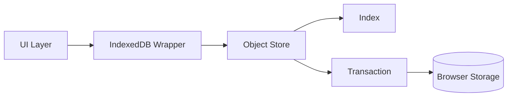

# IndexedDB Is the Browser Database localStorage Never Was

Meta Description: Learn what IndexedDB is, how it differs from localStorage, when to use it, and how to implement it in a framework-agnostic way.
Main Keyword: indexeddb vs localstorage
Source: User-provided prompt request

If you need to store more than a few strings in the browser, localStorage is usually the first thing people reach for.

That is also where the trouble starts.

localStorage is synchronous, small, and crude. IndexedDB is asynchronous, larger, and annoying enough that people avoid it until they have already painted themselves into a corner.

## TL;DR

- IndexedDB is the browser's built-in database for structured client-side data.
- localStorage is fine for tiny settings, but it falls apart quickly for anything bigger or more dynamic.
- IndexedDB gives you indexing, transactions, larger storage, and async access.
- The trade-off is complexity. You pay with a steeper API and a little more setup.
- Any frontend stack can use IndexedDB cleanly with a small wrapper.

## What IndexedDB Actually Is

IndexedDB is a client-side NoSQL database built into the browser.

It stores objects, supports indexes, and lets you query data without loading everything into memory first. That makes it a much better fit than localStorage for offline caches, draft data, task queues, app state snapshots, and anything else that grows beyond "a couple of preferences and a theme flag."

The important part is not that it lives in the browser. The important part is that it behaves like a database rather than a key-value drawer with ambitions.

## IndexedDB Versus localStorage

Here is the practical comparison.

| Dimension | localStorage | IndexedDB |
|---|---|---|
| API style | Synchronous | Asynchronous |
| Data model | String key-value pairs | Structured objects |
| Querying | Manual filtering | Index-based lookups |
| Transactions | No | Yes |
| Storage size | Small | Much larger |
| Main-thread impact | Can block UI | Designed to avoid blocking |
| Complexity | Very simple | More moving parts |
| Best use | Tiny preferences | Real client-side data |

localStorage is useful because it is trivial.

You can write a value in one line and read it back in one line.

That simplicity is also the trap. Every read and write happens synchronously on the main thread, which means a bigger payload can add jank right where you do not want it.

IndexedDB avoids that problem by being asynchronous.

## Why IndexedDB Is Worth the Extra Complexity

The first benefit is size.

The second benefit is structure.

The third benefit is that you can query data without manually deserializing everything and scanning it yourself every time the app starts.

That matters when your app needs any of the following:

- offline-first behavior,
- cached API responses,
- saved drafts,
- large lists or search indexes,
- background sync queues,
- data that needs to survive reloads without bloating memory.

If you try to do that with localStorage, you end up rebuilding a worse database by hand.

That is a hobby. Not a good one.

## Trade-Offs You Should Actually Care About

IndexedDB is not a free win.

The main trade-off is developer ergonomics.

The native API is awkward. It uses events, versioned upgrades, object stores, transactions, and callback-heavy control flow that feels like browser history decided to punish you for optimism.

The other trade-off is debugging.

When something goes wrong, it is usually one of these:

- you forgot to open a transaction,
- the database version upgrade failed,
- the object store name is wrong,
- the browser kept stale schema state,
- you are reading before initialization completes.

So yes, IndexedDB gives you a lot more power.

It also makes you earn it.

## When You Should Use IndexedDB

Use IndexedDB when your browser data has any of these traits:

- it is larger than a few kilobytes,
- it needs to be queried by fields, not just keys,
- it must survive reloads and offline usage,
- it is written and read often,
- you care about not blocking the main thread.

Do not use IndexedDB for:

- theme preference,
- a single auth flag,
- a one-off counter,
- anything you can comfortably keep in memory.

If the data is tiny and flat, localStorage is easier.

If the data is real, IndexedDB is the right tool.

## A Minimal IndexedDB Mental Model

Think in four layers:

1. The database.
2. One or more object stores.
3. Optional indexes inside those stores.
4. Transactions that read or write data safely.



The wrapper is optional in theory and practical in reality.

Most developers use a small helper library so they can write normal async code instead of hand-rolling event listeners like it is 2013 and everybody is still excited about modal dialogs.

## Framework-Agnostic Implementation Pattern

You do not need framework-specific APIs to use IndexedDB well.

What you need is a small storage module with three responsibilities:

1. open and upgrade the database,
2. expose typed read and write helpers,
3. keep UI logic separate from persistence logic.

Here is a minimal implementation using only browser APIs.

```ts
// storage/indexeddb.ts
const DB_NAME = 'app-db';
const DB_VERSION = 1;
const STORE_NAME = 'drafts';

type Draft = {
  id: string;
  title: string;
  body: string;
  updatedAt: number;
};

function openDatabase(): Promise<IDBDatabase> {
  return new Promise((resolve, reject) => {
    const request = indexedDB.open(DB_NAME, DB_VERSION);

    request.onupgradeneeded = () => {
      const database = request.result;
      if (!database.objectStoreNames.contains(STORE_NAME)) {
        database.createObjectStore(STORE_NAME, { keyPath: 'id' });
      }
    };

    request.onsuccess = () => resolve(request.result);
    request.onerror = () => reject(request.error);
  });
}

export async function saveDraft(draft: Draft): Promise<void> {
  const database = await openDatabase();
  const transaction = database.transaction(STORE_NAME, 'readwrite');
  transaction.objectStore(STORE_NAME).put(draft);

  return new Promise((resolve, reject) => {
    transaction.oncomplete = () => resolve();
    transaction.onerror = () => reject(transaction.error);
  });
}

export async function getDraft(id: string): Promise<Draft | undefined> {
  const database = await openDatabase();
  const transaction = database.transaction(STORE_NAME, 'readonly');
  const request = transaction.objectStore(STORE_NAME).get(id);

  return new Promise((resolve, reject) => {
    request.onsuccess = () => resolve(request.result as Draft | undefined);
    request.onerror = () => reject(request.error);
  });
}
```

Then wire it into your UI lifecycle however your stack prefers.

```ts
// Generic UI flow (framework-agnostic pseudocode)
async function initializeEditor() {
  const existing = await getDraft('draft-1');
  if (existing) {
    renderDraft(existing);
  }
}

async function onSaveClick(nextDraft: Draft) {
  renderDraft(nextDraft); // optimistic UI update
  await saveDraft({ ...nextDraft, updatedAt: Date.now() });
}
```

The main idea is stable across React, Vue, Svelte, Angular, or vanilla JS:

- initialize from async storage,
- keep the UI responsive,
- write back through a dedicated persistence layer.

## What Usually Goes Wrong

The common mistakes are boring and very real.

People use IndexedDB as if every read must round-trip through a giant object store, even when a small index would do.

People also open the database repeatedly instead of centralizing the connection logic.

And people forget schema upgrades are a thing, then act surprised when a stored object shape changes and the browser does exactly what they asked, which was to preserve the old schema forever.

Use a wrapper if you can.

The native API is fine for learning.

It is not fine for sanity.

## Practical Rule of Thumb

If the data is a setting, use localStorage.

If the data is an app, use IndexedDB.

That is not a formal standard, but it is close enough to keep you out of trouble.

## FAQ

## What is IndexedDB in web development?

IndexedDB is the browser's built-in database API for storing structured data on the client side.

It supports transactions, indexes, and asynchronous access, which makes it better suited for real app data than localStorage.

## Is IndexedDB better than localStorage?

For anything beyond tiny key-value settings, yes.

IndexedDB is more capable, more scalable, and less likely to block the main thread. localStorage is simpler, but that simplicity stops helping once your data grows.

## What are the disadvantages of IndexedDB?

The main drawback is complexity.

The API is awkward, schema upgrades are more involved, and debugging can be annoying if you are not using a wrapper library.

## Should I use IndexedDB in my frontend stack?

Yes, if the app needs offline data, drafts, cached API results, or any other persistent client-side state that is larger than a few strings.

The pattern is framework-agnostic as long as your UI can call async read and write functions.

## Closing

Use localStorage when you need a drawer.

Use IndexedDB when you need a database.

If you build browser features that are expected to survive reloads, offline use, or real data growth, IndexedDB is the safer bet and the less embarrassing bug report later.