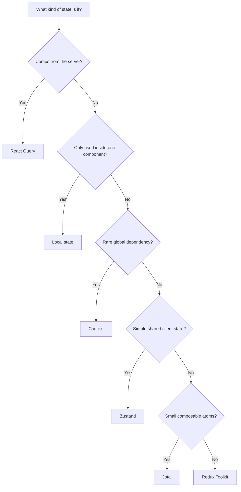

# Most Apps Do Not Need Redux in 2026. Here Is the State Stack I Would Use Instead


Most apps do not have a state management problem.

They have a state classification problem.

People see data changing in more than one place and immediately reach for Redux, as if every shared value deserves a centralized ceremony. Usually the app just needs a cleaner split between server state, local UI state, and the few values that actually deserve to be global.

## TL;DR

- My default in 2026 is not Redux.
- Use React Query for server state.
- Use local state for UI state.
- Use Context for rare, truly global dependencies.
- Use Zustand when you need simple shared client state without a lot of boilerplate.
- Use Jotai when your state is naturally composable and atomic.
- Reach for Redux Toolkit when state transitions are complex, shared across many features, or need strong conventions and excellent debugging.

## The Real Question Is Not "Which Library?"

The real question is what kind of state you have.

Once you answer that honestly, the library choice gets a lot less religious.

There are four buckets most React apps actually live in:

- **Local UI state**: open menus, form fields, selected tabs, modal visibility.
- **Server state**: fetched data, cached data, refetchable data, request status.
- **Global app state**: theme, auth session, locale, feature flags, app shell settings.
- **Client workflow state**: multi-step drafts, wizard progress, shared editor state, cross-component interactions.

If you collapse all four into one store, you do not get simplicity.

You get a pile of unrelated values pretending to be architecture.

## My Default State Stack in 2026

If I were starting a new app today, this is the stack I would use by default:

1. **React local state** for UI that only matters inside one component or a small subtree.
2. **React Query** for anything that comes from the server.
3. **Context** for low-frequency global values that are more about wiring than state.
4. **Zustand** for shared client state that is genuinely app-wide but not complicated enough to justify Redux.
5. **Jotai** when I want state as small, composable atoms instead of one store.
6. **Redux Toolkit** only when the app has enough shared client-side complexity that the extra structure pays for itself.

That is the short version.

The slightly annoying truth is that most apps need the first three and never touch the last three.

## Why Redux Is Usually the Wrong First Move

Redux still solves real problems.

It just solves a narrower set of problems than people think.

The classic Redux pitch was predictability: one store, one-way data flow, explicit updates, easy debugging.

That was valuable when React state patterns were messier, side effects were harder to reason about, and app-level consistency was more expensive to enforce.

In 2026, a lot of the old justification has been eaten by better alternatives.

React Query handles server data far better than Redux ever did.

Local state handles component state without ceremony.

Zustand and Jotai give you shared client state without a bunch of action boilerplate you will later defend in a retro for no good reason.

Redux becomes worth it when you need the things it is still actually good at:

- strict update discipline,
- complex shared transitions,
- strong devtools and time-travel debugging,
- many teams touching the same state model,
- predictable conventions at scale.

If you do not need those, Redux is often architecture-by-reflex.

## Server State Is Not App State

This is where a lot of Redux debates go sideways.

Fetched data is not the same thing as client workflow state.

If the data comes from an API, caches, background refetches, stale flags, retries, and invalidation rules matter more than reducers do.

That is why React Query is the default.

It already knows how to cache, refetch, invalidate, deduplicate, and track loading/error states without you writing a custom state machine for every endpoint.

A typical React Query setup looks like this:

```tsx
import { useQuery } from '@tanstack/react-query';

type Project = {
  id: string;
  name: string;
};

async function fetchProjects(): Promise<Project[]> {
  const response = await fetch('/api/projects');
  if (!response.ok) {
    throw new Error('Failed to load projects');
  }
  return response.json();
}

export function ProjectList() {
  const { data, isLoading, error } = useQuery({
    queryKey: ['projects'],
    queryFn: fetchProjects,
  });

  if (isLoading) return <p>Loading...</p>;
  if (error) return <p>Something broke.</p>;

  return (
    <ul>
      {data?.map((project) => (
        <li key={project.id}>{project.name}</li>
      ))}
    </ul>
  );
}
```

That is the right abstraction for server state.

Not Redux.

Not Zustand.

Not "let's put the fetch result in Context and hope nobody mutates it."

## Local State Should Stay Local Until It Has Proven Otherwise

Most UI state never needs to escape the component that owns it.

A modal open flag does not deserve a global store.

A controlled input does not deserve a global store.

A dropdown selection does not deserve a global store.

If the state only matters for rendering a piece of UI, keep it there.

```tsx
import { useState } from 'react';

export function RenameDialog() {
  const [open, setOpen] = useState(false);
  const [name, setName] = useState('');

  return (
    <div>
      <button onClick={() => setOpen(true)}>Rename</button>
      {open ? (
        <div>
          <input value={name} onChange={(event) => setName(event.target.value)} />
          <button onClick={() => setOpen(false)}>Close</button>
        </div>
      ) : null}
    </div>
  );
}
```

This is boring.

That is the point.

Boring local state is usually correct state.

## Context Is for Wiring, Not for Everything

Context is great when the value changes rarely and lots of descendants need it.

Theme, locale, auth session metadata, and service instances are all fine fits.

Where Context gets ugly is when people turn it into a state manager.

If you are updating Context frequently and many components depend on it, you may be in rerender hell. That is not a theoretical problem. It is the kind that shows up as "why is the whole page flickering" at 4:45 p.m.

Use Context for:

- dependency injection,
- low-frequency global values,
- app shell configuration,
- singleton-like state.

Do not use it as a replacement for a proper client state store just because it is already there.

## When Zustand Is the Better Default Than Redux

Zustand is my default for shared client state when I want something simple.

It gives you a small store, direct updates, and very little ceremony.

That is a good fit for app-wide UI state that is not server state and not a giant event-driven domain model.

Example:

```tsx
import { create } from 'zustand';

type UiState = {
  sidebarOpen: boolean;
  toggleSidebar: () => void;
  setSidebarOpen: (open: boolean) => void;
};

export const useUiStore = create<UiState>((set) => ({
  sidebarOpen: false,
  toggleSidebar: () => set((state) => ({ sidebarOpen: !state.sidebarOpen })),
  setSidebarOpen: (open) => set({ sidebarOpen: open }),
}));

export function SidebarButton() {
  const sidebarOpen = useUiStore((state) => state.sidebarOpen);
  const toggleSidebar = useUiStore((state) => state.toggleSidebar);

  return <button onClick={toggleSidebar}>{sidebarOpen ? 'Hide' : 'Show'} sidebar</button>;
}
```

Zustand is usually enough when you want:

- shared state without Redux boilerplate,
- direct updates,
- simple subscriptions,
- an easy mental model.

If the store starts becoming a miniature operating system, you probably crossed the line where Redux starts making more sense.

## When Jotai Is the Better Fit

Jotai makes sense when state feels naturally atomic.

Instead of one big store, you build from small pieces that compose into bigger pieces.

That is useful when you want derived state, localized dependencies, and a clean way to share only the specific values that need to be shared.

Example:

```tsx
import { atom, useAtom } from 'jotai';

const countAtom = atom(0);
const doubledCountAtom = atom((get) => get(countAtom) * 2);

export function Counter() {
  const [count, setCount] = useAtom(countAtom);
  const [doubledCount] = useAtom(doubledCountAtom);

  return (
    <div>
      <p>Count: {count}</p>
      <p>Doubled: {doubledCount}</p>
      <button onClick={() => setCount((value) => value + 1)}>Increment</button>
    </div>
  );
}
```

Jotai is nice when:

- state pieces are small and composable,
- derived values matter,
- you want to avoid a monolithic store,
- you prefer state as building blocks instead of a central domain reducer.

It is less nice when your app logic is highly procedural and you need one place to model a lot of coordinated transitions.

## When Redux Toolkit Still Wins

Redux Toolkit is the right answer when the client state is genuinely complex and shared across the app in a way that benefits from formal structure.

That usually means one or more of these are true:

- many features read and write the same state,
- transitions are event-driven and need to be explicit,
- you need reproducible debugging across lots of user interactions,
- the team is large enough that conventions matter more than raw brevity,
- you want a strong pattern for domain logic, middleware, and side effects.

Example:

```tsx
import { createSlice, configureStore, PayloadAction } from '@reduxjs/toolkit';
import { Provider, useDispatch, useSelector } from 'react-redux';

type Todo = {
  id: string;
  title: string;
  done: boolean;
};

type TodosState = {
  items: Todo[];
};

const todosSlice = createSlice({
  name: 'todos',
  initialState: { items: [] } as TodosState,
  reducers: {
    added(state, action: PayloadAction<Todo>) {
      state.items.push(action.payload);
    },
    toggled(state, action: PayloadAction<string>) {
      const todo = state.items.find((item) => item.id === action.payload);
      if (todo) {
        todo.done = !todo.done;
      }
    },
  },
});

const store = configureStore({
  reducer: {
    todos: todosSlice.reducer,
  },
});

type RootState = ReturnType<typeof store.getState>;

function TodoList() {
  const todos = useSelector((state: RootState) => state.todos.items);
  const dispatch = useDispatch();

  return (
    <div>
      {todos.map((todo) => (
        <label key={todo.id}>
          <input
            type="checkbox"
            checked={todo.done}
            onChange={() => dispatch(todosSlice.actions.toggled(todo.id))}
          />
          {todo.title}
        </label>
      ))}
    </div>
  );
}

export function App() {
  return (
    <Provider store={store}>
      <TodoList />
    </Provider>
  );
}
```

Redux is not about "can I store state here?"

Of course you can.

It is about whether the explicit state model is worth the ceremony.

When you need predictable transitions, middleware, devtools, and shared conventions, it still earns its keep.

## Decision Flow for 2026



That is the default decision tree I would use.

It is boring in the best possible way.

## What Not to Do

Do not start with Redux because the app might get complicated later.

That is future-you's problem, and future-you is already tired.

Do not put server state in Redux just because you already have Redux.

Do not put everything in Context because it feels native to React.

Do not choose Zustand or Jotai because they are trendy and look lighter on slides.

Choose the tool that matches the shape of the state you actually have.

## FAQ

## Is Redux still relevant in 2026?

Yes.

It is still a strong choice for complex, shared client state with explicit transitions, middleware, and strong debugging needs.

It is just not the default for most apps anymore.

## What should I use for global state in React?

Start by asking whether the state is really global.

Use Context for rare global values, Zustand for simple shared client state, Jotai for atomic composable state, and Redux Toolkit when the state model is complex enough to justify the structure.

## Why not use Redux for server state?

Because server state has its own rules.

Caching, invalidation, retries, deduplication, and refetching are better handled by React Query than by manually pushing API results through a Redux store.

## Zustand or Jotai, which is better?

Neither is universally better.

Use Zustand when you want a small store with straightforward shared state. Use Jotai when your state naturally breaks into atoms and derived values.

## Closing

My default in 2026 is simple: keep UI state local, keep server state in React Query, keep rare globals in Context, and reach for Zustand, Jotai, or Redux Toolkit only when the app shape makes them worth it.

Redux is still excellent when you need it.

It just should not be the first thing you reach for when a button is open and the data is loading. That is not architecture. That is panic with a package manager.