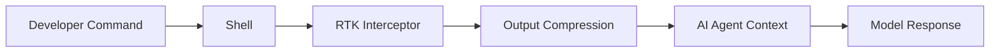

# RTK for AI Coding Agents: How a 10ms Shell Wrapper Cut Token Usage by About 80%

Meta Description: RTK is a Rust shell wrapper for AI coding agents that compresses CLI output before it hits model context windows, reducing token usage and cost.
Main Keyword: rtk ai coding agent token reduction
Source: User-provided LinkedIn post reference with repo: https://lnkd.in/gtw33ya5

If you are using an AI coding agent without output compression, you are likely paying a token tax on every terminal command.

The expensive part is not always your prompt. It is the command output that gets shoved into the model context, line by line, command after command.

RTK attacks that bottleneck directly.

## TL;DR

- RTK sits between your shell and your coding agent, intercepting command output.
- It compresses common developer command output before that output enters model context.
- Benchmarks from your reference show about 118,000 tokens down to about 24,000 in a 30-minute session, roughly 80% less.
- Overhead is reported as under 10ms, so the workflow stays responsive.

## Why AI Coding Sessions Burn Tokens Faster Than Expected

Most coding sessions are command-heavy:

- `git diff`
- `cargo test`
- `pytest`
- `grep`
- `ls`
- `docker` output

None of those commands are individually dangerous.

The problem is cumulative context growth. A long terminal trace can quickly dwarf the prompt itself.

If your agent re-reads bloated output repeatedly, cost and latency climb together.

## What RTK Does in the Shell Data Path

RTK is implemented as a lightweight Rust binary and placed in the shell path between your commands and the model-facing side of your agent workflow.

At a high level, it performs command-aware output compression before context ingestion.

That means the model sees less noise and more signal.

The upside is obvious for test output, diffs, and verbose logs where many lines are repetitive.

## The Benchmark Numbers Worth Caring About

From your provided reference:

- Typical 30-minute coding session: about 118,000 tokens to about 24,000 tokens.
- Reduction: about 80%.
- Real usage example: 1,000,000 tokens saved in a single day.
- Runtime overhead: less than 10ms.

These are useful numbers because they map to day-to-day workflows, not synthetic toy prompts.

## Why This Matters Beyond Cost

Lower token volume gives you more than smaller invoices.

You also get:

- lower end-to-end turn latency,
- less context overflow pressure,
- better headroom for larger architectural prompts,
- less truncation risk on longer debugging sessions.

In practice, this often feels like your assistant stopped forgetting half the terminal state.

## Tooling Compatibility

Your reference indicates RTK works with:

- Claude Code
- GitHub Copilot
- Cursor
- Windsurf
- Gemini CLI
- Codex

That broad compatibility matters because teams rarely run a single agent stack.

## Trade-Offs and What RTK Cannot Solve

RTK compresses output. It does not magically fix bad prompts or weak acceptance criteria.

It also introduces one more infrastructure component in your local toolchain.

Potential constraints to plan for:

- you need to validate command coverage for your team-specific tools,
- highly custom logs may need tuning,
- you still need disciplined context strategy for architecture-level tasks.

## How to Evaluate RTK in Your Team This Week

1. Pick two common workflows: test-debug and refactor-review.
2. Measure baseline token usage for a 30-minute session.
3. Run the same workflows with RTK enabled.
4. Compare token volume, latency, and result quality.
5. Keep only if quality is stable and savings are material.

A practical pass threshold is simple: if you save at least 30 to 40% without accuracy regressions, keep it.

## FAQ

## What is RTK in AI coding workflows?

RTK is a lightweight Rust binary that intercepts shell command output and compresses it before the output reaches an AI agent context window.

## Does compression hurt debugging quality?

It can if critical lines are dropped.

You should run A/B sessions and compare resolution time and fix accuracy before rolling out widely.

## Is this only about cost savings?

No. It also improves context headroom and often lowers latency on long command-heavy sessions.

## Do I still need prompt discipline if I use RTK?

Yes.

Compression helps with output volume. It does not replace clear task scoping, constraints, and verification in your prompts.

## Closing

If your AI coding workflow feels expensive and noisy, RTK is one of the few interventions that targets the real bottleneck.

The quickest next step is to benchmark one afternoon of real work against your current baseline and decide with numbers, not vibes.