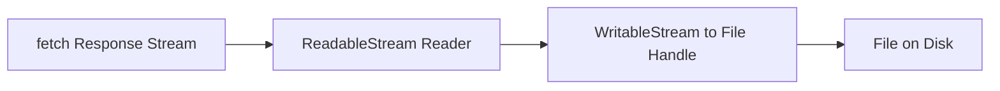

# Browser File Downloads at Scale: Why showSaveFilePicker Beats Blob URL Hacks for Large Files

Meta Description: Learn when to use showSaveFilePicker for large browser downloads, how streaming writes reduce memory pressure, and how to implement a safe fallback.
Main Keyword: showSaveFilePicker large file download
Source: User-provided LinkedIn post reference with source: https://lnkd.in/gMUduY7D

Most frontend teams still download files with the classic Blob URL pattern.

It works for small files, then quietly falls apart when files get large and memory pressure spikes.

`showSaveFilePicker()` is the first browser API in this space that feels like it was built for real workloads.

## TL;DR

- `URL.createObjectURL()` requires buffering the full response before download trigger.
- `showSaveFilePicker()` can stream data directly to disk in supported browsers.
- For files above 100MB, streamed writes are often the difference between smooth UX and tab instability.
- You still need feature detection and a fallback path for non-supporting browsers.

## Why the Old Blob Download Pattern Breaks Under Load

Classic flow:

1. fetch file,
2. convert to Blob,
3. create temporary `<a>` element,
4. click it programmatically,
5. revoke URL.

The issue is not correctness.

The issue is architecture: the browser must hold the entire payload in memory before save begins.

For large files, that creates avoidable memory spikes, longer time-to-first-byte perception, and higher crash risk on weaker devices.

## What showSaveFilePicker Changes Technically

`window.showSaveFilePicker()` opens a native Save As dialog and returns a writable file handle.

That handle supports streaming writes.

So instead of buffering the complete payload, you write chunks progressively as they arrive.



This aligns download architecture with modern streaming patterns used in backend services.

## A Practical Implementation Pattern

Use feature detection first, then stream when available.

```ts
export async function downloadFile(url: string, suggestedName: string) {
  if ("showSaveFilePicker" in window) {
    const handle = await (window as any).showSaveFilePicker({
      suggestedName,
      types: [{
        description: "Download",
        accept: { "application/octet-stream": [".bin", ".zip", ".csv", ".pdf"] },
      }],
    })

    const writable = await handle.createWritable()
    const res = await fetch(url)

    if (!res.ok || !res.body) {
      await writable.abort()
      throw new Error(`Download failed: ${res.status}`)
    }

    const reader = res.body.getReader()

    try {
      while (true) {
        const { done, value } = await reader.read()
        if (done) break
        await writable.write(value)
      }
      await writable.close()
    } catch (err) {
      await writable.abort()
      throw err
    }

    return
  }

  // Fallback for unsupported browsers
  const res = await fetch(url)
  if (!res.ok) throw new Error(`Download failed: ${res.status}`)
  const blob = await res.blob()
  const objectUrl = URL.createObjectURL(blob)

  const a = document.createElement("a")
  a.href = objectUrl
  a.download = suggestedName
  document.body.appendChild(a)
  a.click()
  a.remove()

  URL.revokeObjectURL(objectUrl)
}
```

## Trade-Offs and Current Limitations

Your reference correctly calls out two major constraints:

- browser support is mainly Chromium-family today,
- secure context (HTTPS) is required.

So this is not a universal replacement yet.

It is a progressive enhancement strategy.

## UX and Performance Comparison

`showSaveFilePicker()` path:

- native filename and location selection,
- chunked writes,
- reduced memory pressure.

`URL.createObjectURL()` path:

- no native Save As flow,
- full buffering for typical implementations,
- higher memory risk for large files.

For teams shipping admin dashboards and export-heavy workflows, this difference is material.

## How to Roll This Out Safely

1. Implement dual-path download logic with feature detection.
2. Add telemetry for browser capability and download failure reasons.
3. Load-test with 100MB, 500MB, and 1GB files.
4. Track memory footprint and user completion rates.

Do not guess. Measure.

## FAQ

## Is showSaveFilePicker production-ready?

It is production-usable in supported Chromium browsers, with fallback for others.

Treat it as progressive enhancement.

## Do streamed writes always improve performance?

Usually for large files, yes.

For tiny files, user-visible gains are often negligible.

## Can I use showSaveFilePicker on HTTP localhost?

Localhost is generally treated as secure in modern browsers for development.

Production still requires HTTPS.

## Should I delete Blob URL fallback today?

No.

Keep fallback until support requirements in your user base are fully Chromium-compatible.

## Closing

If your product exports large files, this is one of the cleanest frontend wins available right now.

Adopt `showSaveFilePicker()` where supported, keep fallback for reach, and validate with real file-size telemetry.